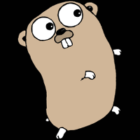

# GOPHY



Small Python binding to the GIF module in Golang. Create an animated GIF from an array of image locations.

Supported image types are:

* PNG
* JPEG
* GIF

## Usage

### Python side
```python
    from gophy import img2gif

    files = ["./res/g1.gif", "./res/g2.gif", "./res/g3.gif"]
    out = "./out.gif"
    fps = 4
    img2gif(files, out, fps)
```


### Golang
```go
	files := []string {"./picture_1.png",
	"./picture_2.png"}

	fps := 2
	out := "./out.gif"

	img2gif.BuildGif(&files, fps, out)
```

## Installation

`$pip install git+https://github.com/ritchie46/GOPHY.git`